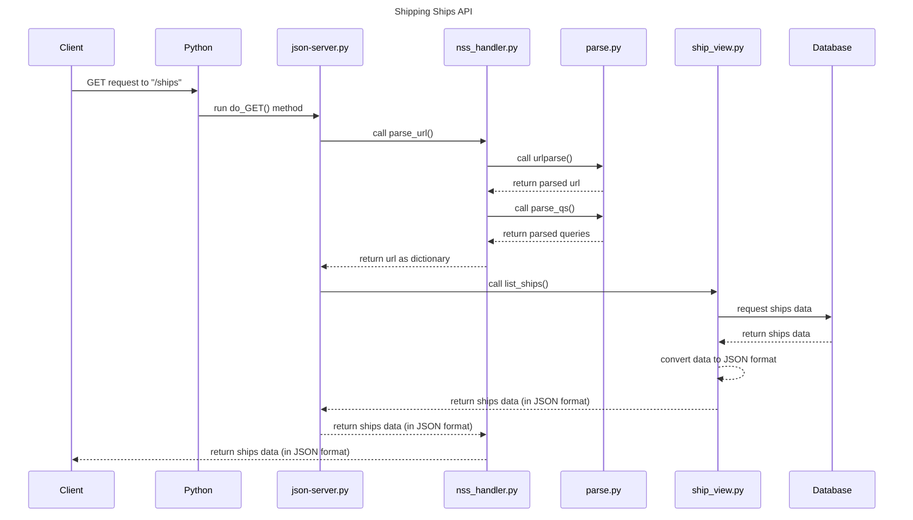

```mermaid
sequenceDiagram
    title Shipping Ships API

    participant Client
    participant Python
    participant json-server.py
    participant nss_handler.py
    participant parse.py
    participant ship_view.py
    participant Database

    Client->>Python: GET request to "/ships"
    Python->>json-server.py: run do_GET() method
    json-server.py->>nss_handler.py: call parse_url()
    nss_handler.py->>parse.py: call urlparse()
    parse.py-->>nss_handler.py: return parsed url
    nss_handler.py->>parse.py: call parse_qs()
    parse.py-->>nss_handler.py: return parsed queries
    nss_handler.py-->>json-server.py: return url as dictionary
    json-server.py->>ship_view.py: call list_ships()
    ship_view.py->>Database: request ships data

    Database-->>ship_view.py: return ships data
    ship_view.py-->>ship_view.py: convert data to JSON format
    ship_view.py-->>json-server.py: return ships data (in JSON format)
    json-server.py-->>nss_handler.py: return ships data (in JSON format)
    nss_handler.py-->>Client: return ships data (in JSON format)

```
